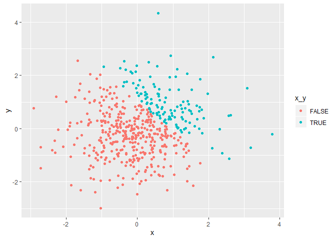
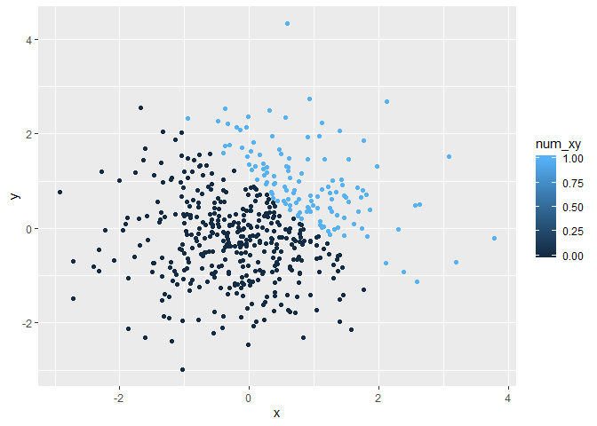

p8105\_hw1\_yj2580
================
yj2580
9/14/2019

## Problem 1

``` r
# Creat a data frame
set.seed(100)
hw1_df1 = tibble(
  random_samp = rnorm(8, mean = 0, sd = 1),
  logical_vec = random_samp > 0,
  char_vec = c("a", "b", "c", "d", "e", "f", "g", "h"),
  factor_vec = factor(c("level I", "level II", "level III", "level II", "level III", "level III", "level I", "level I"), levels =c("level I", "level II", "level III"))
)

# pull variables from the dataframe, and take the mean of each variable.
mean(pull(hw1_df1, random_samp))
```

    ## [1] 0.1256937

``` r
mean(pull(hw1_df1, logical_vec))
```

    ## [1] 0.625

``` r
# mean(pull(hw1_df1, char_vec))    it doesn't work
# mean(pull(hw1_df1, factor_vec))  it doesn't work
```

Comment: When taking the mean of each variable, random sample vector and
logical vector worked but character vector and factor vector failed. The
reason is that random sample vector and logial vector are numeric while
character vector and factor vector are not. (Although the output of
logical vector is “TRUE” and “FALSE”, it is considered as “0” and “1” by
default in system.) Only numeric vectors can be successfully involved in
computation.

``` r
# apply the as.numeric function to the logical, character, and factor variables, and show this chunk but not the output using "eval=false"

mean(as.numeric(pull(hw1_df1, logical_vec)))
#mean(as.numeric(pull(hw1_df1, char_vec)))
mean(as.numeric(pull(hw1_df1, factor_vec)))
```

Comment: After converting logical vector, character vector and factor
vector to numeric, mean of logical vector stays the same, mean of factor
vector still fails to work, and mean of factor vector becomes available,
resulting in 2. The reason for the change of the mean of factor vector
is that its output becomes “1”, “2” and “3” instead of
string.

``` r
#convert the logical vector to numeric, and multiply the random sample by the result
as.numeric(pull(hw1_df1, logical_vec)) * pull(hw1_df1,random_samp)
```

    ## [1] 0.0000000 0.1315312 0.0000000 0.8867848 0.1169713 0.3186301 0.0000000
    ## [8] 0.7145327

``` r
#convert the logical vector to a factor, and multiply the random sample by the result
#as.factor(pull(hw1_df1, logical_vec)) * pull(hw1_df1,random_samp)
#it doesn't work

#convert the logical vector to a factor and then convert the result to numeric, and multiply the random sample by the result
as.numeric(as.factor(pull(hw1_df1, logical_vec))) * pull(hw1_df1,random_samp)
```

    ## [1] -0.50219235  0.26306233 -0.07891709  1.77356962  0.23394254  0.63726018
    ## [7] -0.58179068  1.42906542

Comment: After converting the logical vector to a factor, its output is
string which can not be multiplied. However, after converting this
factor into numeric, its outputing value transformed from “0”, “1”
(TRUE/FALSE) into “1”,“2” (DIFFERENT LEVELS).

## Problem 2

``` r
# Create a data frame
set.seed(200)
hw1_df2 = tibble(
  x = rnorm(500, mean = 0, sd = 1),
  y = rnorm(500, mean = 0, sd = 1),
  x_y = x + y > 1,
  num_xy = as.numeric(x_y),
  fac_xy = as.factor(x_y)
)
```

The size of the dataset is 500 rows and 5 columns. The mean is
0.0187947. The median is 0.015362. And the standard deviation of x is
0.9676439. The proportion of cases for which x + y \> 1 is
0.25.

``` r
#Make a scatterplot of y vs x; color points using the logical variable and export it. 
ggplot(hw1_df2, aes(x = x, y = y, color = x_y)) + geom_point()
```

<!-- -->

``` r
ggsave("plot1_colored_by_logicalVector.pdf")
```

    ## Saving 7 x 5 in image

``` r
#Make a scatterplot that color points using the numeric variables.
ggplot(hw1_df2, aes(x = x, y = y, color = num_xy)) + geom_point()
```

<!-- -->

``` r
#Make a scatterplot that color points using the factor variables.
ggplot(hw1_df2, aes(x = x, y = y, color = fac_xy)) + geom_point()
```

<!-- -->

Comment: These three scatterplots all show the same pattern that
different color points are separated by a line, which approximately
follows x + y = 1. Above this line, all dots satisfy the condition that
x + y \> 1, displayed in green or light blue color. Below this line, all
dots satisfy the condition that x + y \< 1, displayed in red or dark
blue color. There are also obvious patterns in how these dots are
distributed. Around that line, most of the dots gather here intensively.
Away from that line, a smaller amount of dots are sparsely spread.
